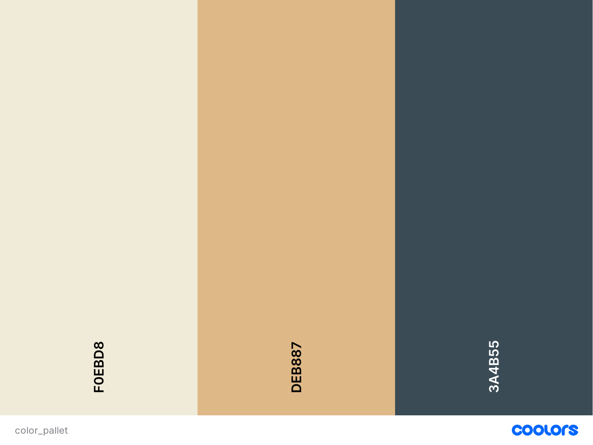
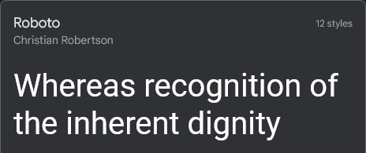
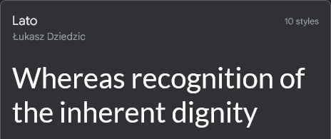
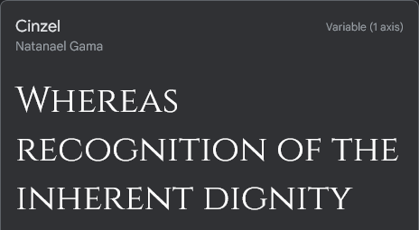

# **Think Tank**(Philosophy Website/ First Project)

## [Think Tank](https://kurtm36.github.io/Think-Tank-philosophy-website-/)   is a entry point website for people who are interested in learning Philosophy.  

Think Tank is an online platform that aims to explore and delve into the fascinating world of philosophy. This website provides a curated collection of philosophers, their history as well as their teachings related to various philosophical topics.

---

## Technologies used 
- HTML
- CSS
- Google fonts
- Font Awesome icons

## User  Stories

- As a first time visitor: I want to understand theme and topic of the website, so I can learn more about the subject.

- As a first time visitor: I want to be able to easily navigate through the website, so I can find the information I am looking for.

- As a mobile device user: I want the website to be responsive, so I can use my hone or tablet to visit it.

- Explore Different Philosophers: A first-time user might want to delve into various philosophers and their topics and gain a broad understandi   ng of different schools of thought. They may aim to learn about ethics, metaphysics, epistemology, logic, aesthetics, and more.

- Find Beginner-Friendly Resources: Newcomers to philosophy may seek beginner-friendly resources that provide clear explanations and introduc tions to fundamental philosophical concepts. They may want to find introductory philosophers to begin with or videos that break down complex ideas into more accessible language

## Features

### Design

When designing this website I wanted a calm and soft aesthetic that was easy on the eyes. To achieve this I used a nice blend of soothing colors and I embraced the white space and incorpated it into my design.

- Color pallet
- 

### Fonts
 

- I used Roboto for its legibilty and its aethestic for my header  
  

- I used Lato for my content on the main page to keep the soft look and feel 
 
  
- I used Cinzel for its striking visual look to enchance my hero image 
  
  

--- 

### Home page

#### Navigation

- Postioned at the top of the page.
- Contains Logo positioned on the left.
- At the right hand side , there are navigation links.
    - Home - leads to homepage.
    - What is Philosopy - leads to text and video of the topic.
    - Westen and Eastern Philsopohers - leads to reading content on ancient philosophers.
    - Contact - Leads to a contact page , where users can sign up.
- The location of the user on the website is underlined.
- The links have animated hover effect.
- The navigation is clear and easy to understand for the user.
- The navigation bar is responsive and appears on mobile devices. 

---

---

--- 

--- 

---

### Hero Section

- Hero image is clear and non pixelated 

 

- Hero image has a cover-text quote from a philosopher on each page.

## What is / Western-Eastern Philosophy Section

### Content goals

- Clear and concise answer as to what the subject is about .

-  Video related to the topic at hand. [What is Philosophy (Author:The School of Life)](https://www.youtube.com/watch?v=mIYdx6lDDhg)

---

- Clear and concise explanation as to the differences between Western and Eastern philosophy.
  

---

## Philosopher Section 

- Clear and concise explanation of who the anicent philosophers
- Quick summary of the philosophers history and their philosophical topics and concepts  
- Non compressed and clear images  

---

## Contact Page

- All text input fields are customized.
- Allow the user to stay updated on subjects that they will be interested in
- To allow the user to sign up and recieve a monthly newsletter relating to philosophy 
- Design a sign up form inline with the website color and theme 

- Once user has submitted the form , display a thank you message informing them about the website status

---

## Footer 

- Prompt the user to engage with the website on other social medias i.e Facebook , Twitter , Instagram , Twitter.

- When user hovers on icons , displays a hover effect. 

- Follow the color and theme of website in regards to footer styling. 

- Display logo on footer.

 

## Testing

- I tested that the website works in different browsers: Firefox , Opera , Chrome, Edge.
- I used [Responsive Website Design Tester](https://responsivedesignchecker.com/) to confirm that the website is responsive , looks and fuctions to all standard screen sizes. 
- Tested all links and can confirm that all of them work and lead where they should lead.

## Bugs 

- Solved Bugs 
    - Footer icon positioning changing : Fixed it by making footer icons centered 
    - Navigation bar not being responsive : fixed it by using display: inline and set media queries with display: flex; justify-content: column/inline
  

- Unsolved Bugs 
  - None as of yet.

## Validator testing 
- HTML
    - I ran my code through [W3C HTML Validator](https://validator.w3.org/nu/?doc=https%3A%2F%2Fkurtm36.github.io%2Fphilosophy-website%2F)

    

- CSS

  - I ran my code through [Jigsaw ](https://jigsaw.w3.org/css-validator/) CSS validator and recieved no errors 

    

- Accessibility and Performance

  - I used Lighthouse in chrome devtools to confirm that the website is performing well and is accessible for all users.

    

---

## Deployment

The site was deployed to GitHub pages. The steps to deploy are as follows:

- In the GitHub repository, navigate to the Settings tab
From the source section drop-down menu, select the Main Branch, then click "Save".

- The page will be automatically refreshed with a detailed ribbon display to indicate the successful deployment.

- The live link can be found here : [Think Tank ](https://kurtm36.github.io/Think-Tank-philosophy-website-/) 

#### Local Deployment

- If you wish to contribute to this project you can clone it !. Follows these steps to clone this repository.
  
  - In order to make a local copy of this project. In your IDE Terminal, type the following command to clone my repository:

  - <code>git clone https://github.com/Kurtm36/Think-Tank-philosophy-website-.git</code>

  - Change directory to the project folder.  

### Credits 

- I used the code to make social the media footer , links and icons  from the Code Institute Love Running project and modified it to fit my website .

- I took inspiration and learned about designing a responsive nav bar from:   [Skillthrive CSS Tutorial: 3 Ways to Create a Navigation Bar with Flexbox](https://www.youtube.com/watch?v=PwWHL3RyQgk)

<li> Media

- I used [Pexels](https://www.pexels.com/) for my images.

## Kurt McGoona 